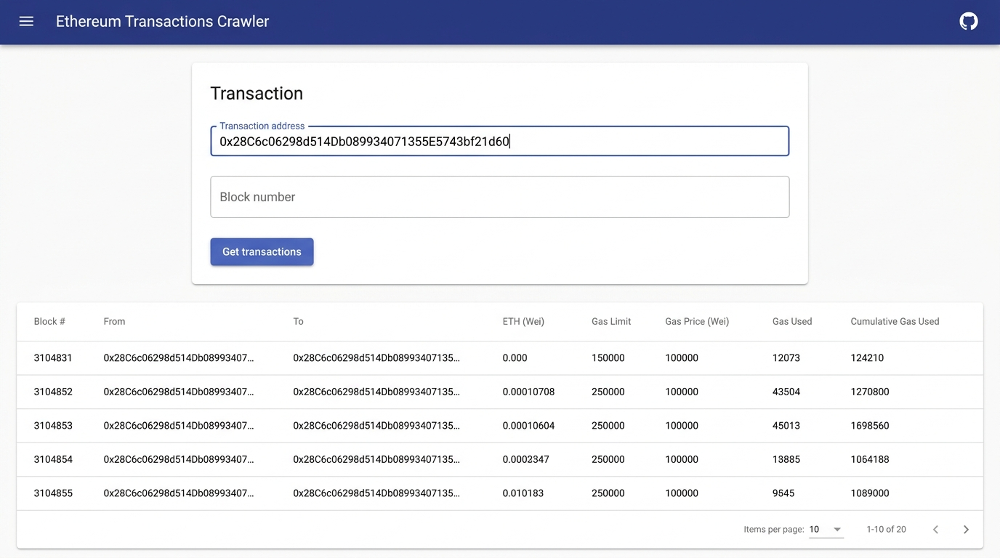

# Ethereum Transaction Crawler (Angular)

An industrial-grade Angular application designed to inspect, search, and crawl Ethereum blockchain account balances and transaction histories via Etherscan APIs.

---

## 📷 User Interface Preview



---

## 💡 Example Ethereum Addresses

You can use these verified 42-character Ethereum addresses to test the crawler application:

| Entity | Address |
| :--- | :--- |
| **Vitalik Buterin (`vitalik.eth`)** | `0xd8dA6BF26964aF9D7eEd9e03E53415D37aA96045` |
| **Binance Hot Wallet** | `0x28C6c06298d514Db089934071355E5743bf21d60` |
| **Ethereum Foundation** | `0xde0B295669a9FD93d5F28D9Ec85E40f4cb697BAe` |

---

## 🌐 Ethereum Network Overview & History

- **Genesis Block Launch:** July 30, 2015 (*Frontier Release*).
- **Network Age:** Over **11+ years** of continuous, decentralized operation.
- **Key Milestones:**
  - **Frontier (2015):** The inaugural Ethereum mainnet launch.
  - **Homestead (2016):** The first major protocol upgrade establishing production readiness.
  - **The Merge (Sept 2022):** Landmark consensus transition from Proof-of-Work (PoW) to Proof-of-Stake (PoS), slashing network energy consumption by 99.95%.
  - **Dencun (2024):** Introduced "blobs" (EIP-4844) to scale Layer-2 rollups dramatically.

---

## 📚 Core Ethereum Terminology Guide

| Term | Definition |
| :--- | :--- |
| **`blockNumber`** | The sequential index of the block in the Ethereum blockchain in which the transaction was mined/included. Block #0 represents the Genesis block in July 2015. |
| **`gas` (Gas Limit)** | The maximum units of computational work the sender allocated for executing this transaction. Simple ETH transfers require a fixed limit of 21,000 gas. |
| **`gasPrice`** | The price per unit of gas paid in **Wei** ($1 \text{ ETH} = 10^{18} \text{ Wei} = 10^9 \text{ Gwei}$). Determines transaction prioritization by network validators. |
| **`gasUsed`** | The actual quantity of gas consumed by the Ethereum Virtual Machine (EVM) to execute the transaction logic. |
| **`cumulativeGasUsed`** | The cumulative sum of gas consumed by this transaction and all previous transactions mined within the **same block**. |
| **`from`** | The 42-character hexadecimal Ethereum account address that signed and initiated the transaction. |
| **`to`** | The destination 42-character address (externally owned account or smart contract) receiving the transaction. |
| **`value`** | The total amount of Ether transferred in the transaction, denominated in **Wei**. |

---

## 📌 Technical Specifications

### 1. Angular Version
- **Angular Core Framework:** `v13.2.0` (`@angular/core`: `~13.2.0`)
- **Angular CLI:** `v13.2.5` (`@angular/cli`: `~13.2.5`)
- **Angular Material & CDK:** `v13.2.5` (`@angular/material`: `^13.2.5`)
- **Build Devkit:** `@angular-devkit/build-angular`: `~13.2.5`

### 2. Runtime Engine Requirements
- **Node.js Engine:** `>=14.15.0` or `^16.10.0`
- **TypeScript Compiler:** `~4.5.2`
- **Package Manager:** `npm` (`>=6.14.0`)

### 3. HTTP Client & Async Architecture
- **HTTP Module:** `@angular/common/http` (`HttpClientModule` imported in `AppModule`)
- **HTTP Client:** `HttpClient` injected into `TransactionServiceService`
- **Async & Reactive Data Pipeline:** `RxJS` (`~7.5.0`) `Observable` streams employing reactive operators (`map`, `catchError`, `throwError`)
- **API Provider:** Etherscan REST API V2 (`https://api.etherscan.io/v2/api?chainid=1`)
- **Serialization & Data Modeling:** `serializr` (`^2.0.5`) for structural model mapping (`Transactions`, `Result`, `TransactionDetails`)

---

## ⚙️ Environment Configuration

This application consumes the Etherscan API Token Key directly via native Angular environment files:

1. **Development Environment:** [src/environments/environment.ts](file:///d:/Projects/EthereumTransactionCrawler/src/environments/environment.ts)
   ```typescript
   export const environment = {
     production: false,
     tokenKey: 'YOUR_ETHERSCAN_API_KEY'
   };
   ```

2. **Production Environment:** [src/environments/environment.prod.ts](file:///d:/Projects/EthereumTransactionCrawler/src/environments/environment.prod.ts)
   ```typescript
   export const environment = {
     production: true,
     tokenKey: 'YOUR_ETHERSCAN_API_KEY'
   };
   ```

---

## 🚀 Getting Started

### Development Server
Run the local development server:
```bash
npm start
# or
ng serve
```
Navigate to `http://localhost:4200/`. The app will automatically reload when source files are modified.

### Production Build
Build the project for production distribution:
```bash
npm run build
# or explicitly:
npm run build:prod
```

#### What happens during a production build?
1. **Environment Replacement**: Angular automatically replaces `src/environments/environment.ts` with `src/environments/environment.prod.ts` via `fileReplacements`.
2. **Optimization & Minification**: Tree-shaking, dead code elimination, AOT (Ahead-of-Time) compilation, and minification are applied.
3. **Cache Busting**: Unique output hashes are appended to bundle filenames (e.g. `main.a1b2c3d4.js`).
4. **Artifact Location**: Compiled production assets are output to `dist/transaction-crawler-angular/`, ready for deployment to Nginx, AWS S3/CloudFront, Vercel, or Netlify.

### Running Unit Tests
Execute unit tests via [Karma](https://karma-runner.github.io):
```bash
npm test
# or
ng test
```
